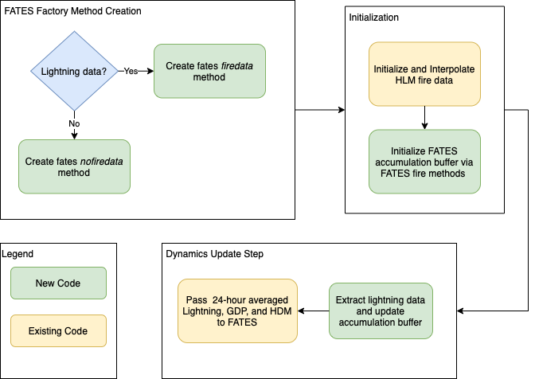

ELM-FATES Fire Data API Design Document
=======================================

Introduction
------------

The goal of this software update is to enable FATES to make use of the fire data provided by the ELM host land model.  FATES currently has a fire data API design that is compatible with CLM.

Design Considerations
---------------------

Assumptions and Dependencies
^^^^^^^^^^^^^^^^^^^^^^^^^^^^

1. The CLM-FATES fire API makes use of `factory type`_ methods to enable the CLM CN-fire code to utilize the same data input methods across different CN versions without having to use a lot of `case select` code.  This is the basis for the CLM-FATES API.  ELM's fire model currently uses the Li 2014 model and does not make use of factory methods.
2. Current host land model inputs to the FATES SPITFIRE model consists of lightning frequency, human population density (HDM), and gross domestic product (GDP).  Lightning frequency and human population density is at the gridcell level.  The lightning frequency data is accumulated into a 24 hour count.  GDP data is at the column level and is passed to FATES, but currently not used by the SPITFIRE model as it is awaiting a feature update.  The inputs are currently available across both host land models and are assumed to be supported in the future. 

.. _`factory type`: https://en.wikipedia.org/wiki/Factory_(object-oriented_programming)

General Constraints
^^^^^^^^^^^^^^^^^^^

- The goal is to enable elm-fates to utilize the same inputs as available through the clm-fates API to facilitate near-term FATES benchmarking goals.  As such, the data input methodologies should deviate from the clm-fates API as little as possible.
- The elm cn-fire code uses `use_cn` logic checks to trigged or avoid fire data interpolation which includes lightning frequecy and HDM.  To enable FATES to utilize this procedure, these check may need to be refactored.  
- The FATES fire data run modes are currently controlled through namelist options and as such will need an update to the ELM build namelist PERL code.

Solutions
---------

1. Replicate the CLM-FATES `factory type`_ method architecture for the ELM-FATES API, but do not utilize a base CN fire data type as the foundation (as in CLM-FATES).
  - Pro: relatively simple and fast to implement as it is mostly a copy/paste of existing API code.  This will facilitate maintenance of the API by the FATES team as well.
  - Con: the structure is somewhat overly designed relative to the ELM fire model.
2. Develop a new API from scratch that might provide a simpler interface for FATES to both ELM and CLM
  - Pro: Takes into consideration current, and potential future ELM fire model plans
  - Con: Would require longer term development effort, pushing out near-term benchmarking goals, given that it would have to coordinate between ELM, CLM, and FATES.

Given the prioritization of near-term FATES goals, E3SM development schedule, and complexity of CLM-FATES API, the first solution has been selected as the design approach.

Design and Architecture
-----------------------

System diagram or flowchart
^^^^^^^^^^^^^^^^^^^^^^^^^^^

The following flowchart diagrams the process of the new ELM code to connect to the existing FATES API.

Rollout Plan
------------

1. Update ELM code with adapted CLM-FATES fire factory methods and necessary 
2. Conduct test cases to validate that all FATES fire data modes work as expected
3. Create pull request to E3SM repository and run FATES Land Developer tests

Future Update Plan
------------------

1. There is a new ML surrogate wildfire model being developed by Qing (LBNL), Riley (LBNL), Randerson (UCI), and Xu (UCI) that is targeted for incorpation into E3SM V4.  FATES is targeted for integration during this version as well.  There are discussions to be planned to help understand and coordinate future elm-side updates to accomodate both fire models.  

Appendix
--------

Implementation Notes and Lessons Learned
----------------------------------------

- Due to pre-existing elm-fates nutrients implementation (which has not been ported to clm-fates) a circular dependency was created when the fire model data stream procedures were being called by elmfates_interfaceMod.F90.  This was partially due to the fact that the `hlm_fates_interface_type` is being used by AllocationMod.F90 to provide access to fates nutrients outputs to elm.  The dependency chain consisted of:

..code-block::

   elmfatesinterfacemod -> AllocationMod -> controlMod -> ndepStreamMod -> FireDataBaseType -> FATESFireBase -> elmfatesinterfacemod

The circular dependency was rectified by refactoring the nitrogen deposition initialization procedure so that it would receive the namelist filename, `NLFilename`, as a character input instead of using the variable directly from controlMod.F90.