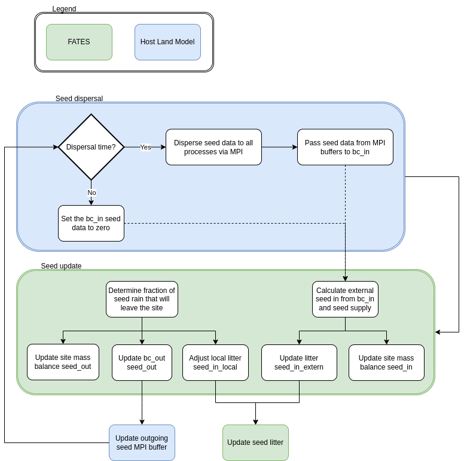

ELM-FATES Cross-Gridcell Seed Dispersal Design
==============================================

Date: 31 October 2022

Written By: Gregory Lemieux (glemieux@lbl.gov)

Introduction
------------

The goal of this software update is to take a fraction of the seed recruitment pool within a given fates site and pass further fractions of that seed amount to other fates sites located on neighboring grid cells.

Solutions
---------

Gridcell communication options
^^^^^^^^^^^^^^^^^^^^^^^^^^^^^^

1. Global gridcell knowledge: Continue use of simple MPI all routine to provide all processes global knowledge of every possible gridcell neighbor
  - Pro: simple to implement and maintain
  - Con: relatively inefficient in both communication and memory compared to other options
2. Halo-implementation: Create "ghost" cells associated with the processes that need to communicate across nodes
  - Pro: More memory efficient and reduces overall amount of message passing
  - Con: More complicated to impliment resulting in more maintenance.  Not ideally suited to round robin distributions?
3. MPI distributed graph
4. ESMF graph
  - Con: Not compatibe with all host land models. ESMF support is not expected to be available for ELM (only CLM)

Design Considerations
---------------------

1. A gridcell-to-gridcell distance calculation function will need to be included that accounts for the curvature of the earth.

Assumptions and Dependencies
^^^^^^^^^^^^^^^^^^^^^^^^^^^^

1. Given that the fates code should be designed with support for both CLM and ELM in mind, the design of the fates interface should be conducted such that it requires as little hlm-specific variation as possible to reduce duplication of effort.
2. The current allocation of fates sites to gridcells is 1:1 and as such it is assumed all seeds coming into a gridcell are completely allocated to that site.  This may change in the future.  
3. The location of the fates site within a given gridcell is not defined relative to the gridcell location.  As such it is assumed to be located at the gridcell lat/lon.
4. The current assignment of the gridcell indices is via a simple round robin distribution method.  This may change in the future.
5. Land decomposition and grid cell index assignment for both ELM and CLM is currently conducted in a similar manner.  This may change in the future.
6. There is an assumption to be made about the maximum extent to which a given set of gridcell neighbors includes.  Mathematically, extremely small fractions of seeds could be dispersed to all other gridcells on the globe, but realistically, some limit should be included.  This also is assumed to make the neighborhood determination more tractable.
7. The design should not assume a cartesian grid layout (i.e. it should support unstructured grids).
8. It is assumed that the process indexing assignment is not dynamic (i.e. it is fixed at initialization and across restarts).

General Constraints
^^^^^^^^^^^^^^^^^^^

1. The design will initially be implemented in elm-fates.  This communication routine should not conflict with future gridcell communication efforts.  As such all design is recommended to be exclusive to fates as much as possible.
2. Given that the seed dispersal will need to communication with processes that will likely not be on the same node (due to round robin process assignment), the design should conduct the nearest neighbor determination as infrequently as possible.  Additionally, the design should minimize the amount of process IO as possible.

Design and Architecture
-----------------------

The design of the grid cell to grid cell seed dispersal structure is comprised of three parts:

1. Nearest neighbor determination
2. Gridcell communication
3. Dispersal kernel implementation

System diagram or flowchart
^^^^^^^^^^^^^^^^^^^^^^^^^^^

The following flowchart depicts the general process of the seed dispersal code:

Algorithm or Pseudo code for main components
^^^^^^^^^^^^^^^^^^^^^^^^^^^^^^^^^^^^^^^^^^^^

The following pseudo code describes how the nearest neighbor data structure is built.  

.. pcode::
  
  \begin{algorithm}
  \caption{Determine Gridcell Neighbors}
  \begin{algorithmic}
  \REQUIRE array gridcell indices, $gdc2glo$
  \REQUIRE domain decomposition information with lat/lon for all gridcells
  \PROCEDURE{DetermineGridCellNeighbors}{$neighbors$}
      \STATE $G = $ \CALL{size}{$gdc2glo$}
      \STATE Initialize a linked list array $neighbors[G]$
      \STATE Initialize $lat[G]$ and $lon[G]$ arrays
      \STATE Pass lat/lon domain information out to all processors into $lat[G]$ and $lon[G]$
      \FOR{$i = 1$ \TO $G - 1$}
          \FOR{$j = i + 1$ \TO $G$}
              \STATE $gd = $ \CALL{GreatCircleDistance}{$i,j,lat,lon$}
              \FOR{$ipft = 1$ \TO $numpft$}
                  \IF{$gd < maxdist[ipft]$}
                      \STATE Create $Ineighbor$ object
                      \STATE $Ineighbor.index = gdc2glo[j]$
                      \STATE $Ineighbor.pdf = $ \CALL{ProbabilityDensity}{$gd,ipft$}
                      \STATE Append $Ineighbor$ to $neighbors[i]$
                      \STATE Create $Jneighbor$ object
                      \STATE $Jneighbor.index = gdc2glo[i]$
                      \STATE $Jneighbor.pdf = Ineighbor.pdf$
                      \STATE Append $Jneighbor$ to $neighbors[j]$
                  \ENDIF
              \ENDFOR
          \ENDFOR
      \ENDFOR
  \ENDPROCEDURE
  \end{algorithmic}
  \end{algorithm}

Rollout Plan
------------

1. Refactor and update original code base along with parameter file.  Conduct simple build and test run cases.
2. Scientific testing and validation on local repositories.  Update code and parameter file as necessary.
3. Generate couple e3sm and fates pull requests and conduct final review and regression tests.

Future Update Plan
------------------

0. Pass seeds to only immediate neighbors assuming a cartesian grid layout.  Simplified processor communication providing global knowledge.  Single pft.
1. Updated nearest neighbor algorithm based on max distance from site that is amenable to unstructured grids.  All pfts possible.  Implement Bullock kernels.
2. Reduced processor communication overhead through improved nearest neighbor algorithm using host land model agnostic routines (i.e. not ESMF dependent).

Appendix
--------

`OSF.io Project Home`_

Bullock, et al (2017). A synthesis of empirical plant dispersal kernels. https://doi.org/10.1111/1365-2745.12666

Review Sign-off
---------------
- Reviewer 1: 

*Sign-off Completed on YYYY-MM-DD*

.. _OSF.io Project Home: https://osf.io/k86z9/?view_only=cd066b8c81ff44eeab00bd968c004dec